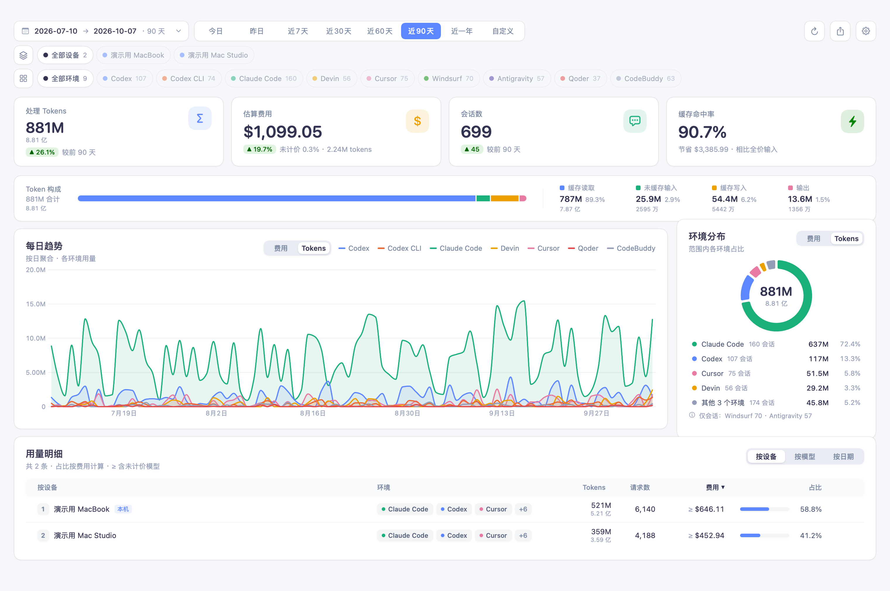
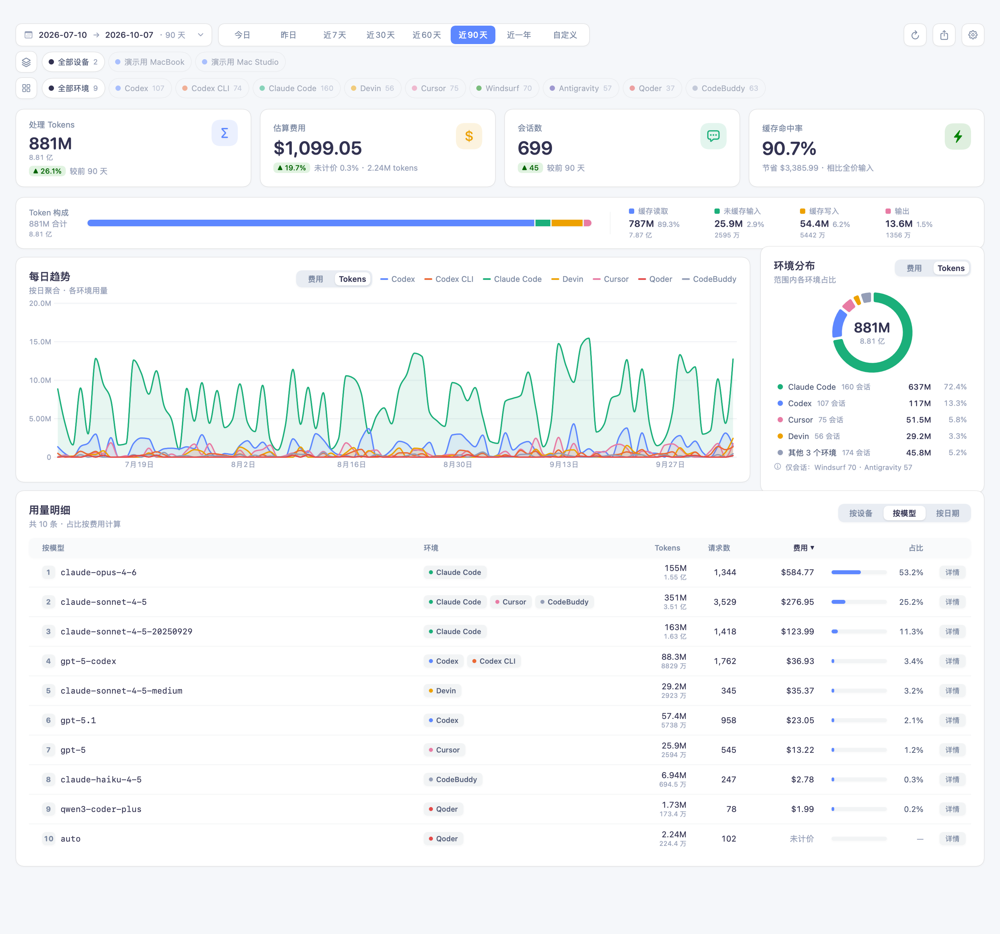
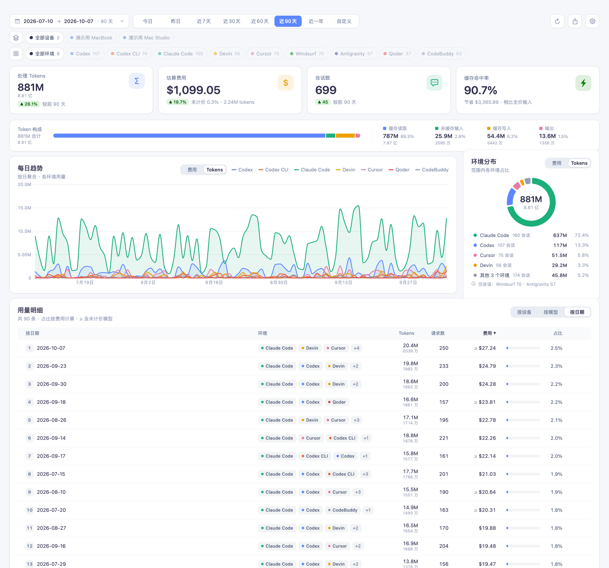
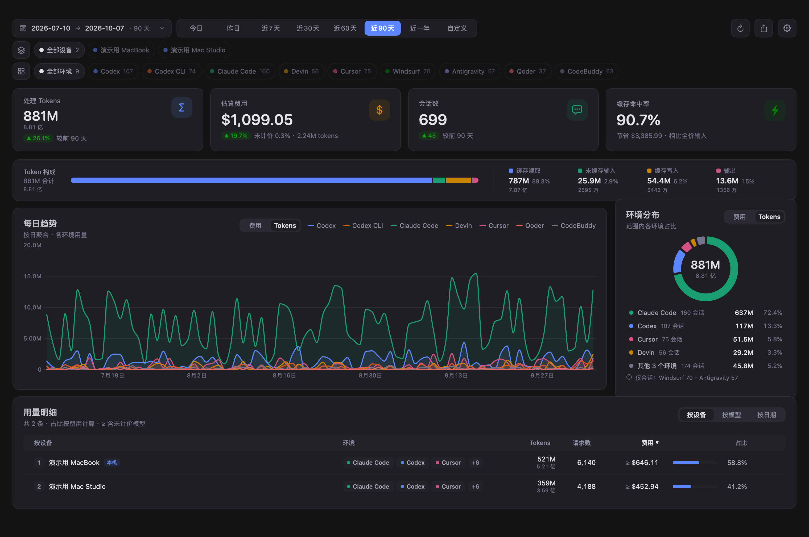
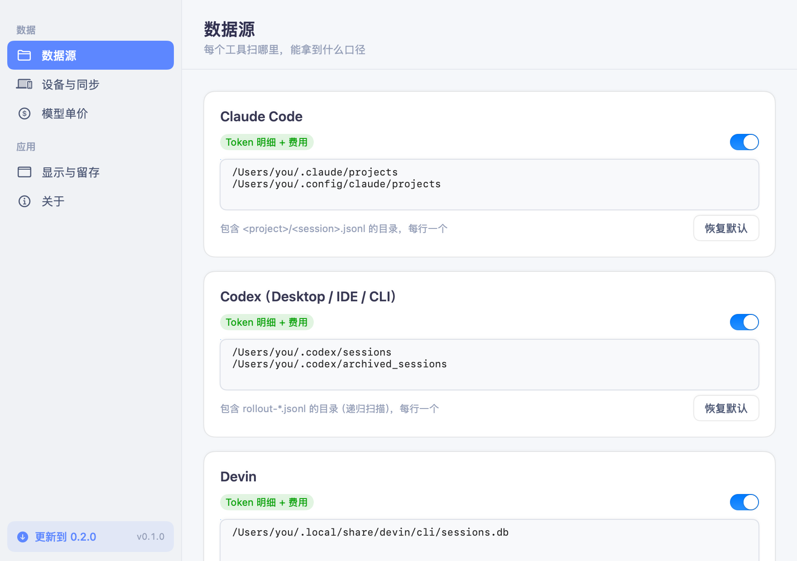
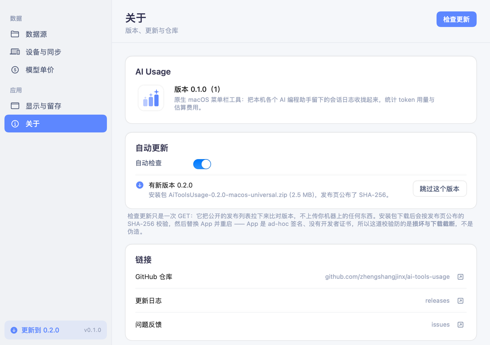
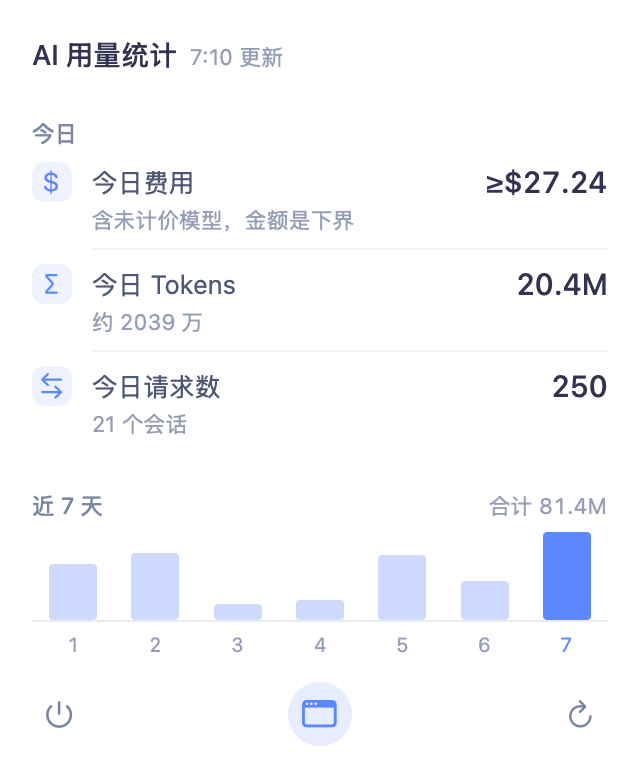
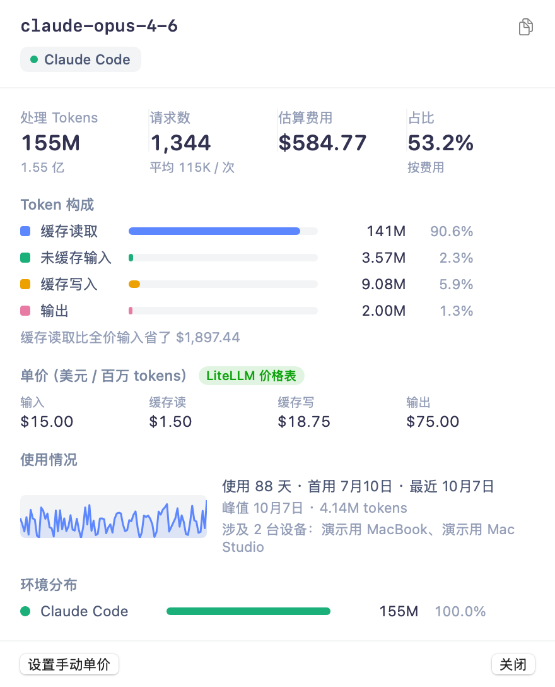
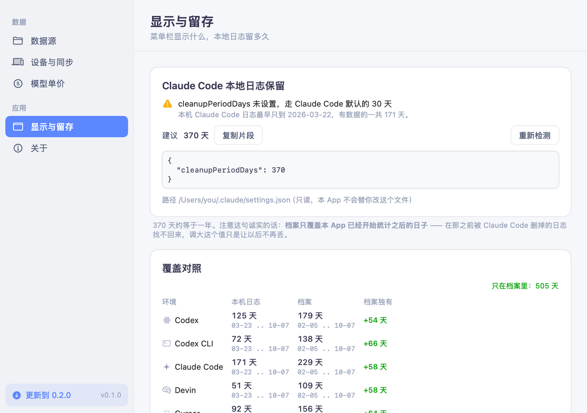

# AI Usage

A native macOS menu bar app that reads the session logs your AI coding assistants leave on disk, and turns them into token usage and estimated cost — one long-lived ledger, across tools and machines.

**English** · [简体中文](README.md)

> The app's UI is currently Simplified Chinese only.



## Name and icon

The app is called **AI Usage** — the Chinese subtitle, 「AI 用量统计」, doesn't fit in the menu bar, where the
bar itself shows whichever numbers you pick (today's cost by default).

The icon is three rounded bars rising left to right, a four-pointed spark above each, in a blue that goes from
pale to saturated: the rightmost bar is exactly `#5D87FF`, the app's accent colour, with the other two lightened.
The rest of the screenshots live in [`docs/images/`](docs/images/).

---

## Why this exists

If you use Claude Code, Codex, Cursor, Devin and Qoder side by side, there is no single place that answers "how much did I spend this month". Usage is scattered across each vendor's own directory, in its own format — and most of them only show you the last 30 days. Claude Code deletes local logs after 30 days by default.

This app gathers those scattered logs into one ledger and solves three things:

1. **See every tool at once**, instead of opening five dashboards.
2. **The ledger outlives the logs.** Daily aggregates are written to iCloud archives. Measured on the author's machine: Codex local logs covered 38 days while the archive covered 85 — 47 days existed only in the archive.
3. **Cost is never persisted — only tokens are.** The archive stores four token buckets; amounts are recomputed at display time from the current price table. So when prices change, historical cost is recalculated rather than frozen at an old rate.

## Features

| Feature | Description |
|---|---|
| **10 data sources** | Claude Code, Codex (Desktop / IDE / CLI), Devin, Cursor, Qoder, CodeBuddy, Windsurf, Antigravity, TRAE |
| **Three breakdowns** | By device / by model / by day, sortable, with the table and chart linked |
| **Cost estimation** | Pulls the LiteLLM price table automatically; unmatched models show `Unpriced` and can be priced by hand |
| **Menu bar** | Today's / this month's cost, tokens and requests next to the icon; a panel with a 7-day mini bar chart on click |
| **Multi-device sync** | Exchanges daily aggregate archives through iCloud Drive — no server involved |
| **Export** | Current filtered result to CSV / TSV / JSON, with full methodological metadata |
| **Retention report** | Per environment: how many days of local logs are left vs. how many the archive holds |
| **Automatic updates** | Checks GitHub Releases from Settings and downloads, verifies, swaps and relaunches in-app; no third-party update framework |

One shot per breakdown, plus a dark one and a few overlays — all in [`docs/images/`](docs/images/):

| By model | By day | Dark |
|---|---|---|
| [](docs/images/main-model.png) | [](docs/images/main-day.png) | [](docs/images/main-dark.png) |

## Supported data sources

| Tool | Local data | How it's read |
|---|---|---|
| Claude Code | `~/.claude/projects/**/*.jsonl` (incl. `subagents/`) | `message.usage` of `assistant` messages, deduplicated by `message.id + requestId` |
| Codex (Desktop / IDE) | `~/.codex/sessions/**/rollout-*.jsonl`, `~/.codex/archived_sessions/` | `last_token_usage` of each `token_count` event, consecutive duplicates counted once; parent-thread history replayed in bulk within 1s of a fork / subagent file is dropped (matching the T3 Code / ccusage convention); model from `turn_context` |
| Codex CLI | Same, split by `session_meta.originator` | Same |
| Devin (Desktop / CLI) | `~/.local/share/devin/cli/sessions.db` (SQLite, WAL) | `message_nodes.chat_message.metadata.metrics`, deduplicated by `message_id`, incrementally scanned by `row_id` |
| Cursor | `~/Library/Application Support/Cursor/User/globalStorage/state.vscdb` | `cursorDiskKV` rows `bubbleId:*` (type 2), `tokenCount.inputTokens/outputTokens`, cache not distinguished |
| Qoder IDE | `~/Library/Application Support/Qoder/SharedClientCache/cache/db/local.db`, `~/.qoder/shared_client/…` | `chat_message.token_info` (prompt / completion / cached); models are mostly auto-routed → unpriced |
| CodeBuddy Code | `~/.codebuddy/projects/**/*.jsonl` | Same format as Claude Code |
| Windsurf | `~/.codeium/windsurf/cascade/*.pb` | **Encrypted locally** (entropy 8.0) — sessions and active days only |
| Antigravity | `~/.gemini/antigravity*/conversations/*.pb` | **Encrypted locally** — sessions and active days only |
| TRAE | `~/Library/Application Support/Trae*/ModularData/ai-agent/database.db` | **SQLCipher-encrypted** (key lives only in process memory) — not readable yet; a placeholder data source |

Sources that can't be read are labelled "encrypted" or "not detected" — **never guessed, never counted as zero**.

Token accounting is unified as:

```
processed = uncached input + cache read + cache write + output
```

(OpenAI's `input_tokens` counts cached tokens; that is subtracted automatically.)

Settings → Data sources lays that table out as an editable list: what each tool can yield (token detail /
sessions only / unreadable) and which directory it is scanned from.



## How it works

**Shape.** Pure SwiftUI — only controls such as `Form` and `TextEditor` are AppKit-backed — with **zero
third-party dependencies**: charts are Swift Charts, SQLite is the system `SQLite3` module opened read-only
(concurrent reads against WAL databases). No SPM packages, no CocoaPods or Carthage. The Xcode project is
generated by XcodeGen from `project.yml`, and the product is a universal arm64 + x86_64 binary.

**Reading.** JSONL is parsed line by line, streaming, keeping only lines that carry usage markers; SQLite is
opened read-only and scanned incrementally by `row_id`; data that is encrypted at rest (Windsurf / Antigravity /
TRAE) is never decrypted — what can be counted as a session is counted as a session, and what can't be read is
labelled as unreadable, **never guessed and never counted as zero**.

**Accounting.** Four token buckets (uncached input / cache read / cache write / output) sum into one `processed`
figure, with each vendor deduplicated by its own key (Claude Code by `message.id + requestId`, Codex by
`token_count` with consecutive duplicates counted once, Devin by `message_id`) — the details are in the table above.

**Across devices.** No CloudKit (it needs a paid account and would break ad-hoc signing); the app reads and
writes JSON archives directly in iCloud Drive. An archive carries only per-day × per-environment × per-model
token buckets and session counts — **no cost, no session ids**. Cost is linear in those four buckets, so the
displaying side recomputes it from whatever price table is current, exactly equivalent to computing per record.
That's why historical cost follows a price change instead of freezing at an old rate.

**Pricing.** LiteLLM's public price table, matched exactly first and fuzzily after (dropping a trailing date,
dropping tier suffixes such as `-medium`). A hand-set price wins over the table, and a model with no price shows
as `Unpriced` rather than `$0.00`.

**Engineering.** Parse results are cached by `(path, size, mtime)` so a refresh re-parses only changed files;
every number in the UI has a machine-readable outlet (`--dump` / `--menu` / `--retention` / `--export`), the
layout has a set of offscreen snapshots (`--render`), and the accounting has 225 assertions (`--selftest`).

## Privacy

This app reads log files that other programs wrote on your machine, so it's worth being precise about what it does:

- **Everything stays local.** No account, no telemetry, no upload. Parse results are cached under `~/Library/Application Support/AIUsage/`.
- **Exactly two outbound requests, both GETs, neither carrying anything that points back at you.** ① At launch it fetches
  [LiteLLM's `model_prices_and_context_window.json`](https://github.com/BerriAI/litellm/blob/main/model_prices_and_context_window.json)
  for pricing; ② at most once every 6 hours it fetches this repo's public GitHub release list to see whether a newer
  version exists (you can turn that off under Settings → About). The update request carries a fixed
  `User-Agent: AIUsage/<version>` and the API version header GitHub asks for — no device identifier, no usage data,
  nothing from your machine. Both are gated to once per 6 hours and both work offline: you just keep the cached
  price table, and the update check simply stays quiet.
- **It never reads credentials.** The retention feature looks at `~/.claude/settings.json`, but reads **only the `cleanupPeriodDays` key**, pulled out with `JSONSerialization`. That file also holds credentials such as `ANTHROPIC_AUTH_TOKEN`; this app does not touch them, print them, log them, or write the file back.
- **The app is not sandboxed** (`com.apple.security.app-sandbox = false`) — it has to read the per-vendor data directories listed above. That is also why it isn't on the App Store.
- **Sync is file-level.** Multi-device sync goes through a directory in your own iCloud Drive and exchanges daily aggregate archives (`device-<deviceId>.json`, containing only token buckets and session counts). The archives contain **no** session ids, no prompt content, and no costs.
- For the encrypted sources (Windsurf / Antigravity / TRAE), this app does not decrypt anything and does not attempt to bypass the encryption.

## Installation

Requires macOS 14+. The published build is a universal binary, so it runs on both Apple Silicon and Intel.

### Download

Grab `AiToolsUsage-<version>-macos-universal.zip` from
[Releases](https://github.com/zhengshangjinx/ai-tools-usage/releases), unzip it, and drag `AI Usage.app`
into Applications.

The app is ad-hoc signed and not notarized, so Gatekeeper blocks the first launch (it says the app is
"damaged" or from an "unidentified developer"). **Right-click → Open**, or clear the quarantine flag:

```bash
xattr -dr com.apple.quarantine "/Applications/AI Usage.app"
```

> No paid developer account behind that notarization: this tool reads the data directories of the AI tools
> on your own machine, and a certificate would not make it any more trustworthy. If that bothers you,
> build it yourself from source below.

### Build from source

Xcode command line tools required.

```bash
brew install xcodegen          # this project is managed with XcodeGen
git clone https://github.com/zhengshangjinx/ai-tools-usage.git && cd ai-tools-usage
xcodegen generate              # required — see below
./scripts/build.sh             # Release universal binary (arm64 + x86_64)
```

The product lands in `build/Build/Products/Release/AI Usage.app`; drag it into Applications.

> **`xcodegen generate` is not optional.** `AIUsage.xcodeproj/` and `AIUsage/Info.plist` are both
> generated from `project.yml` and are not committed (so that adding or removing a Swift file doesn't
> produce hundreds of unreviewable lines of `project.pbxproj` diff). Opening the project right after
> cloning will fail.

To work in Xcode:

```bash
xcodegen generate && open AIUsage.xcodeproj
```

Re-run `xcodegen generate` after adding Swift files.

> **Exporting is opt-in.** `scripts/build.sh` builds through the scheme, and the scheme carries a
> build post-action that runs `scripts/export.sh` to package the product into a directory.
> It **does nothing by default**; to enable it, either use
> `AIUSAGE_EXPORT_DIR="/path/to/dir" ./scripts/build.sh`, or write the directory into
> `scripts/export-dir.local` (which is gitignored).

Your own build comes off the same pipeline as the one in Releases, so it is ad-hoc signed too.

## Automatic updates

The bottom of the settings sidebar is pinned to a line of version status. When a newer version exists it turns into
"**Update to 0.2.0**"; one click downloads the archive in-app and verifies it — size, SHA-256, archive structure,
bundle identity. It **does not touch anything yet**: it stops and asks again with "Restart and update to x.y.z", and
"Later" is always right next to it. Once you confirm, the app quits and a detached shell script replaces the copy in
`/Applications` and relaunches it (quit first, then swap — never a swap while running; if the copy fails the old
version is moved back, because being left on the old version beats being left with no app at all). If the app is
running from `/AppTranslocation/` (double-clicked straight out of your Downloads folder) or its directory isn't
writable, it refuses up front and tells you to replace it by hand.



The check is a single GET of the public release list. It sends nothing about your machine, runs at most once every
6 hours, and can be switched off under Settings → About. It uses `/releases` rather than `/releases/latest` — the
latter means "latest **stable** release", and returns 404 outright when a repo's releases are prereleases.

**Asset naming.** Release assets are always called `AiToolsUsage-<version>-macos-universal.zip`
(`scripts/export.sh` guarantees it; only Debug builds get a timestamp). The updater prefers an exact match on that
name, and falls back to a single candidate only when there is exactly one — guessing wrong shows up as "it offered
0.2.0 and installed the old one", which is miserable to debug.

**Security posture, stated plainly.** What it *can* verify: HTTPS throughout; the download URL and **every redirect**
land on an allowlisted host (release assets 302 to `release-assets.githubusercontent.com`); the length; the SHA-256
published in the release notes; the bundle's structure (bundle id, executable name and version must match the tag,
which catches "tag says 0.2.0, archive contains 0.1.0"); and strictly increasing versions (no downgrade, no
equivalent reinstall). What it *cannot* verify is **who built the archive**: this app is ad-hoc signed with no
developer certificate, so `codesign --verify` only proves that **the bundle is internally intact** — anyone can
ad-hoc sign a bundle of their own. So all of the above guards against **corruption and truncated downloads, not
forgery**; the only real trust anchor remains "HTTPS plus GitHub's account not being compromised", which is the same
trust story as the installation instructions above. A real boundary would need a signing key (public key baked into
the app, releases signed offline) — a different order of magnitude, and not done here.

## Menu bar

The menu bar shows a compact string (today's cost by default). Clicking it opens a rich panel with cost, tokens and requests **split into "Today" and "This month"**, a 7-day mini bar chart, and three footer actions (open main window / refresh now / quit). Which metrics appear where is configured under Settings → Display & Retention → Menu bar (stored as `menubar.config.v1`).



The two sections are separate because the windows differ — six homogeneous numbers in a row read as six metrics of the same time window.

The panel reads **fixed windows** (today / this month) and does not follow the date range selected in the main window.

Turning "Show in menu bar" off only hides the icon. **The Dock icon is a separate mechanism**: when no real window
is on screen the app drops to a menu-bar-only process (Dock icon and menu bar go away together) and comes back
when a window is opened again. Settings has a "keep running after closing the main window" toggle; turning it off
makes closing the window quit the app. There is still **no** `LSUIElement` key — this app opens its main window at
launch (so it starts out `.regular`), and "menu-bar-only" only ever arises from closing the last window, which is a
runtime transition; a static declaration would only add a flip at launch plus two known pitfalls. The reasoning
lives at the top of `ActivationPolicyController`.

One residual risk, stated plainly: on macOS 26 and later a user can remove this app's icon from
System Settings → Menu Bar, and the app can only read its own preference, not that system-side state — it will
wrongly conclude it may drop to menu-bar-only. Reopening the app from Applications recovers it (via
`applicationShouldHandleReopen`). Also, if you turn the menu bar icon off *and* keep "stay running", the app would
have no entry point at all, so that combination deliberately does **not** drop to menu-bar-only — the Dock icon
stays, and Settings shows an orange warning to that effect.

## Pricing

At launch the app fetches unit prices from [LiteLLM](https://github.com/BerriAI/litellm) and caches them under `~/Library/Application Support/AIUsage/` (not refetched within 6 hours). Unmatched models show `Unpriced`; you can price them by hand under Settings → **Model prices** ($ per 1M tokens). Manual prices win.

Cost is **never persisted — only tokens are**. The archive stores four token buckets, and amounts are computed at display time from the then-current price table. Exports therefore carry the price table version (`pricing.lastUpdated`) — after a price change, only a matching version explains a discrepancy.

The model detail popover shows where a given unit price came from (matched in the table, or set by hand) and how
the four buckets split — cache reads usually account for nine tenths, and at a tenth of the input rate, so the
money they saved is stated there too.



## Data retention

**Claude Code keeps local logs for only 30 days by default** (`cleanupPeriodDays`; unset on the author's machine). This app's iCloud archive is untouched by that — those days may be long gone from local logs while still present in the archive.

Settings → Display & Retention lays this out per environment (local logs X days / archive Y days / N days archive-only) and suggests `370`, with a copyable JSON snippet. **The app will not edit `~/.claude/settings.json` for you** — that file holds credentials, and we read only the one `cleanupPeriodDays` key and never write back.

One honest caveat: **the archive only covers days since it started observing.** Logs that were already cleaned up before you installed this app cannot be recovered.
The settings page states both: the recommendation on top, the per-environment comparison underneath (the green
column is the days that exist only in the archive).



## Export

The export button (`square.and.arrow.up`) at the right of the main window's filter bar saves the **current filtered result** as CSV / TSV / JSON. What you export is the table you're looking at: same rows, same order, same share basis — rows come from `UsageStore.visibleRows`, the same source the table uses.

- CSV / TSV carry a UTF-8 BOM, CRLF line endings and RFC 4180 escaping — otherwise Excel renders columns like `claude-sonnet-5（日常使用）` as mojibake.
- Numbers are always raw values and dates use ASCII `yyyy-MM-dd`, **not** the UI formatting (`Formatters.tokens` would produce `12.4M`; human-readable is not machine-readable).
- `null` ≠ `0`: unmeasurable request counts are left empty (with `requests_partial` saying "this is a lower bound"), unpriced cost is left empty (`cost_partial=true`), and incomplete components are reported honestly as `unclassified_tokens` — **never guessed as input**.
- JSON additionally carries `meta` (export time, app version, breakdown, date range, filters, sorting, **price table version**) plus per-row `tokens_components` and `prices`.
- It writes only to the path you choose and never auto-writes into the iCloud sync directory (that belongs to the device archives).

## Command-line checks

Every number in the UI has a machine-readable outlet. Each flag performs a **real scan of local logs** (the same data the UI uses), prints, and calls `exit(0)`; add `--demo` to read synthetic data from memory instead (see the table below).

```bash
APP="build/Build/Products/Release/AI Usage.app/Contents/MacOS/AI Usage"

"$APP" --dump 7            # summary for the last 7 days (a bare integer — see below)
"$APP" --menu              # the menu bar panel's numbers: today / this month / last 7 days
"$APP" --retention         # retention: local logs vs. iCloud archive coverage, cleanupPeriodDays
"$APP" --selftest          # parsing / aggregation / cross-device schema / export / retention; exit 0 when green
"$APP" --render /tmp/r     # main window, settings, menu panel — one PNG each for light and dark
"$APP" --bench             # re-rasterizes the whole page and reports the median
"$APP" --export /tmp/x csv model   # export without touching the UI (omit format and breakdown for 3×3 = 9 files)

"$APP" --render /tmp/r --demo      # synthetic data — this is how the screenshots above were produced
```

| Flag | Effect |
|---|---|
| `--dump [days]` | Prints the summary, 90 days by default. **Pass a bare integer**: `--dump 7`. `--dump "7 days"` doesn't error but **silently does nothing** — it parses with `Int($0)` and falls back to 90 days when that fails |
| `--menu` | Menu bar summary (fixed windows: today / this month / last 7 days), plus a final `label:` line — the string actually shown in the menu bar, assembled from your configuration. Matching numbers don't mean the string is right: defects like `今日 $ $16.86` are only visible once the assembled string is printed |
| `--retention` | Retention table. Prints the `cleanupPeriodDays` value **only** and touches nothing else in `~/.claude/settings.json` |
| `--selftest` | 225 assertions; non-zero exit on failure |
| `--render <dir>` | Offscreen snapshots (views backed by AppKit — `TextEditor`, `Form`, `Menu` — go through a real `NSWindow`, see `RenderHarness.captureWindow`; views whose height follows their content measure themselves, see `captureFitting`) |
| `--bench` | Median rasterization time for the main window |
| `--export <dir> [csv\|tsv\|json] [device\|model\|day]` | Export in three formats per breakdown, byte-for-byte checkable |
| `--demo` | Demo mode, **appended after one of the flags above**. Data becomes synthetic (`AIUsage/Demo/DemoData.swift`, a fixed-seed xorshift, so runs are reproducible) and everything that touches disk or network is shut off: the defaults domain becomes a throwaway suite, pricing goes offline, scanning reads in-memory archives, the iCloud directory points at a fake path. It does **not** promise "never touches the real defaults domain" — rendering builds real windows, and **AppKit itself** writes window frames into the real domain; those are restored to their previous values on exit (see the header of `DemoRuntime`). `scripts/shoot.sh` exports the domain before and after and fails outright if the content differs |

`--selftest`'s red lines: it **never touches `ScanCache.shared`** (which reads, writes and prunes cache files under
`~/Library/Application Support/AIUsage/`) and **never writes `UserDefaults.standard`, nor any domain holding user
configuration**. Parsing cases use synthetic fixtures in temp directories, deleted afterwards, with no network access
(prices are injected as fixed values). The one group that does need to exercise reads and writes (window-close behaviour)
uses a **throwaway suite** (`UserDefaults(suiteName: "aiusage.selftest.<UUID>")`, removed along with its backing file
afterwards) that has nothing to do with the app's configuration domain — `defaults read com.local.aiusage` must be
byte-identical before and after a self-test run.

## Caching

Parse results are cached by file `(path, size, mtime)` in `~/Library/Application Support/AIUsage/scan_cache_v3.json`. The first full scan takes about ten seconds; later refreshes parse only changed files. Settings → Data sources has "Clear cache and rescan".

## Project layout

```
AIUsage/
├── App.swift                  App entry, the three scenes, offscreen render harness (--render / --bench)
├── SelfTest.swift             Every --selftest assertion
├── Demo/                      Synthetic data and the demo-mode switch behind --demo
├── Providers/                 Per-source parsers, scan cache, SQLite reader
├── Store/UsageStore.swift     The single source of truth for aggregation, filtering, sorting
├── Pricing/                   LiteLLM price table, manual overrides
├── Sync/DeviceSync.swift      Reading, writing and merging iCloud archives
├── Retention/                 Retention report
├── Export/                    CSV / TSV / JSON export
├── MenuBar/                   Menu bar configuration and panel
├── Update/                    GitHub Releases check, download verification, bundle swap
├── Views/                     Main window and components
└── Util/                      Formatting, theme tokens
scripts/
├── build.sh                   One-shot Release universal build
├── shoot.sh                   Produce the screenshots the README uses (--render --demo)
├── export.sh                  Optional packaging export (skipped by default)
└── export-dir.local           Local export directory (not committed)
docs/images/                   The README's screenshots; see the README in that directory
project.yml                    The single source of truth for the project (XcodeGen)
```

## Known limitations

- **The UI is Simplified Chinese only**; no localization has been done.
- **Windsurf / Antigravity / TRAE expose no tokens**: their local data is encrypted, so only session counts and active days are reported.
- **Costs are estimates**, computed from LiteLLM's public price table. Subscriptions, credit packs and enterprise discounts are not modelled.
- **Multi-device sync is "each device writes its own archive"** with no conflict resolution — changing a device's id leaves two archives side by side. By design, sessions never overlap across devices, so summing by day is correct.
- **Tested only on macOS 14+**; a universal binary is produced but Intel has not been verified on real hardware.

## License

[MIT](LICENSE) © 2026 zhengshangjinx

Price data comes from [LiteLLM](https://github.com/BerriAI/litellm) (MIT).
This project is not affiliated with, authorized by, or endorsed by Anthropic, OpenAI, Cursor, Devin or any other AI vendor.
